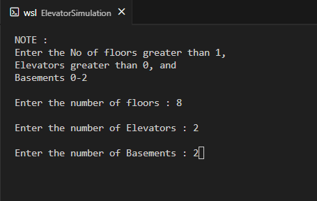
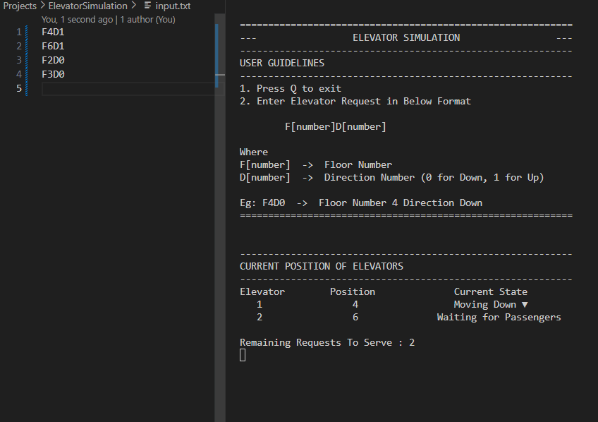

# Elevator Simulator

## Project Overview

This project simulates an elevator system for building with given number of elevators, basement levels and floors, sharing the same set of up/down buttons. It is designed to efficiently handle user requests while ensuring maximum elevator utilization and minimum idle time.

### Goal:

**To design an efficient elevator scheduling system that:**

- Determines which elevator should respond to a user's request.
- Optimizes stops when multiple requests are made in the same direction.
- Handles queued requests for elevators that are already in motion.
- Implements multithreading to simulate real-time elevator operation.

## Features

- Configurable
  - Number of floors
  - Number of Basements
  - Number of Elevators
- User Input via `Input.txt` file
  - Requests are in format `F[number]D[number]` (case-insensitive).
    1. `F[number]` -> Floor number
    2. `D[number]` -> Direction (0 for down, 1 for up)
  - Example: `F4D0` -> Floor 4, direction Down
- Live Console UI
  - Refreshes every second to show current elevator positions, states, and remaining requests.
- Multithreaded Elevator Simulation
  - Each elevator operates in a separate thread.
  - Requests are served concurrently and efficiently.
  - Elevators pick requests intelligently to minimize idle time.
  - Multiple requests in the same direction are served with minimal halts.
  - Ensures maximum efficiency — no elevator stays idle unnecessarily.

## Running the Project

#### Prerequisites

- C++11 or higher compiler (for std::thread support)
- GTest and Gmock (for running unit tests)

#### Compile and Run

Run the shell script present in `scripts/compile.sh` from root of the project using:

```bash
bash ./scripts/compileAndRun.sh
```

To run the unit tests:

```bash
bash ./scripts/runUnitTests.sh
```

## Scheduling Algorithm

1. Check for idle elevators → assign request to closest idle elevator.
2. Check for elevators already moving in the requested direction → assign if it optimizes stops.
3. If no suitable elevator → assign to elevator with least jobs.
4. Elevator serves requests in directional order to reduce travel time.

## Future Enhancements

- Logging elevator movements and request statistics for analysis.
- Add CMake files for building and running the code.

## Demo

- Find the video for demo - 
- Configuration Screen - 
- Simulation Screen - 
